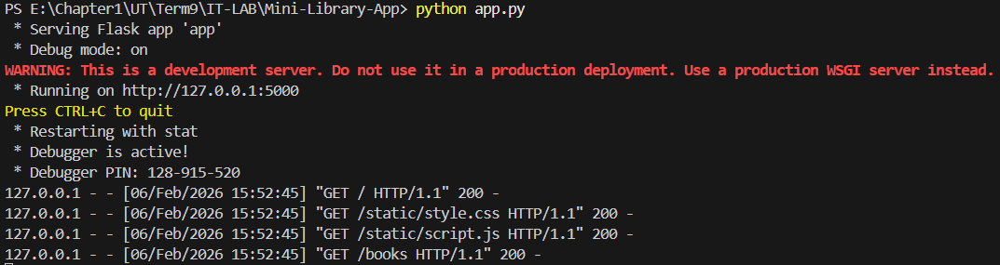
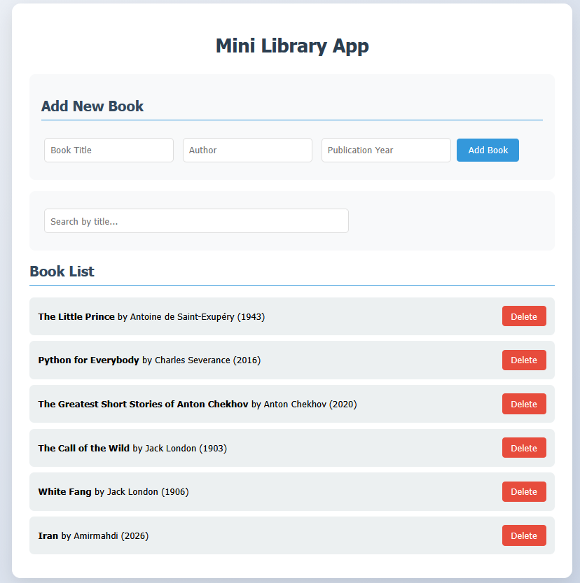
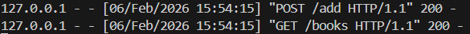
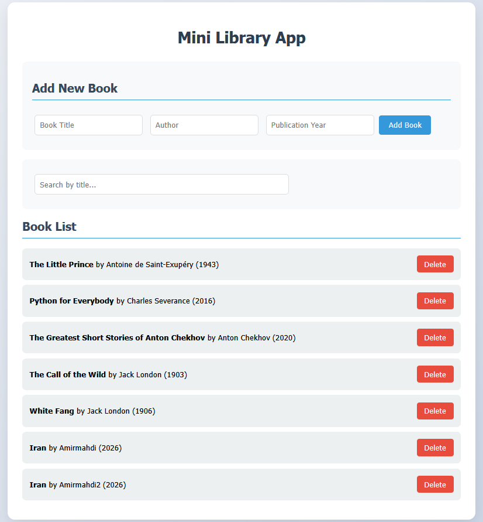
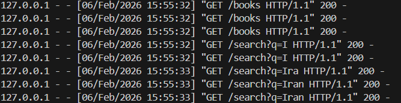
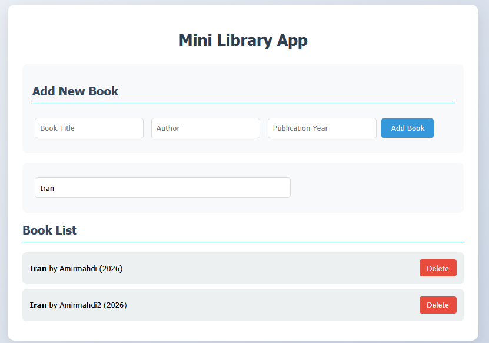
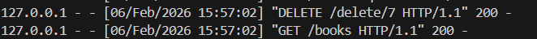
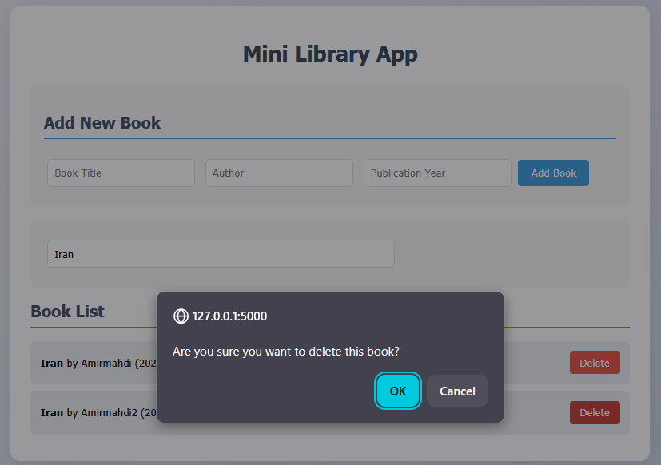

# Mini Library App 📚

**کتابخانه کوچک آرش** – پروژه جلسه ششم  
سیستم مدیریت ساده کتاب برای کتابخانه محلی با ذخیره‌سازی پایدار در فایل JSON 💾  
شامل نسخه کنسولی و **رابط کاربری وب کامل، ریسپانسیو** (امتیازی UI) ✨

## اعضای تیم 👤
- امیرمهدی فرزانه  
- شماره دانشجویی: ۸۱۰۱۰۰۱۹۴

## ویژگی‌های اصلی پروژه 🚀
- ➕ **افزودن کتاب** (عنوان، نویسنده، سال انتشار)
- 🗑️ **حذف کتاب** (با شناسه کتاب)
- 🔍 **جستجو** بین کتاب‌ها (بر اساس بخشی از عنوان – بدون حساسیت به حروف کوچک/بزرگ)
- 📋 **نمایش همه کتاب‌ها**
- 💾 **ذخیره‌سازی پایدار** در فایل `books.json`
- 🌐 **رابط کاربری وب** 

## اهداف آموزشی پروژه 🎯
- طراحی و پیاده‌سازی یک سیستم نرم‌افزاری ساده
- تمرین کار با Git و GitHub در محیط واقعی (Branching, Pull Request, Review, Conflict و ...)

## پیش‌نیازها 🛠️
- Python 3.8 یا بالاتر
- Flask (برای اجرای رابط کاربری وب)

```bash
pip install -r requirements.txt
```

## نحوه اجرا ▶️

python main.py

### ۲. اجرای رابط کاربری وب🌟

python app.py

سپس در مرورگر به آدرس زیر بروید:
🔗 http://localhost:5000

## ساختار پروژه 📁

<pre>
mini-library-app/
├── books.json              📄 ذخیره دائمی کتاب‌ها (شامل ۵ کتاب نمونه انگلیسی)
├── main.py                 🐍 برنامه اصلی کنسولی
├── app.py                  🌐 سرور Flask برای رابط کاربری وب
├── requirements.txt        📦 وابستگی‌های پروژه (Flask)
├── .gitignore              🚫 فایل‌های غیرضروری
├── README.md               📖 این فایل – مهم‌ترین معیار ارزیابی!
├── templates/
│   └── index.html          🎨 قالب صفحه وب
└── static/
    ├── style.css           🎨 استایل بروز و ریسپانسیو
    └── script.js           ⚙️ جاوااسکریپت برای جستجوی زنده و عملیات پویا
</pre>
جاوااسکریپت برای جستجوی زنده و عملیات پویا

## داده‌های نمونه 📖

فایل books.json شامل ۵ کتاب کلاسیک انگلیسی است تا بتوانید بلافاصله تمام قابلیت‌ها را تست کنید:
<pre>
The Little Prince – Antoine de Saint-Exupéry (1943)
Python for Everybody – Charles Severance (2016)
The Greatest Short Stories of Anton Chekhov – Anton Chekhov (2020)
The Call of the Wild – Jack London (1903)
White Fang – Jack London (1906)
</pre>
## رابط کاربری وب (UI) 🎨

این بخش به‌طور کامل و مطابق با شرایط امتیازی پیاده‌سازی شده است:

وجود کامل در Repository
تمام فایل‌های UI در پوشه‌های templates/ و static/ موجود است
اجرای UI در README به صورت گام‌به‌گام توضیح داده شده


رابط کاربری شامل:

فرم افزودن کتاب
جستجوی زنده (بدون رفرش صفحه)
نمایش و حذف پویا کتاب‌ها
طراحی ریسپانسیو و کاربرپسند

## نمونه ورودی و خروجی

۱. نحوه ورود به صفحه



۲. اضافه کردن یک کتاب بوسیله Tab قرار داده شده.




۳. جستجوی کتاب




۴. حذف کتاب



